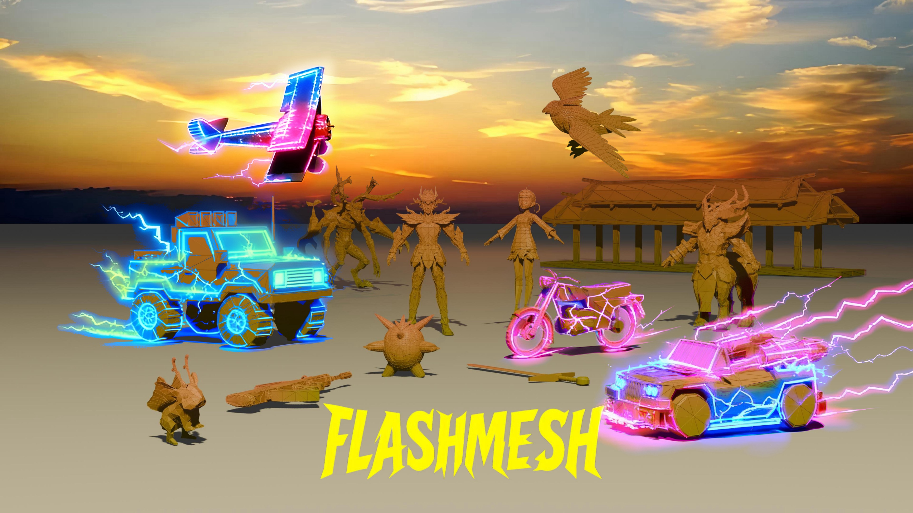

<!-- # ⚡FlashMesh: Faster and Better Autoregressive Mesh Synthesis via Structured Speculation -->

<p align="center">
  <h3 align="center"><strong>⚡FlashMesh: Faster and Better Autoregressive </br> Mesh Synthesis via Structured Speculation</strong></h3>

<p align="center">
    <a href="https://openreview.net/profile?id=~Tingrui_Shen1" target="_blank">Tingrui Shen</a><sup>1*</sup>,
    <a href="https://openreview.net/profile?id=~Yiheng_Zhang1" target="_blank">Yiheng Zhang</a><sup>2*</sup>,
    <a href="https://openreview.net/profile?id=~Chen_Tang1" target="_blank">Chen Tang</a><sup>1*</sup>,
    <a href="https://openreview.net/profile?id=~Chuan_Ping1" target="_blank">Chuan Ping</a><sup>3</sup>,
    <a href="https://openreview.net/profile?id=~Zixing_Zhao1" target="_blank">Zixing Zhao</a><sup>4</sup>,
    <br>
    <a href="https://openreview.net/profile?id=~Le_Wan1" target="_blank">Le Wan</a><sup>4</sup>,
    <a href="https://openreview.net/profile?id=~Yuwang_Wang1" target="_blank">Yuwang Wang</a><sup>2</sup>,
    <a href="https://openreview.net/profile?id=~Ronggang_Wang1" target="_blank">Ronggang Wang</a><sup>5</sup>,
    <a href="https://openreview.net/profile?id=~Shengfeng_He1" target="_blank">Shengfeng He</a><sup>6†</sup>
    <br>
    <sup>1</sup>South China University of Technology,
    <sup>2</sup>Tsinghua University,
    <sup>3</sup>Zhejiang University,
    <br>
    <sup>4</sup>Tencent VISVISE,
    <sup>5</sup>Peking University,
    <sup>6</sup>Singapore Management University
    <br>
    <sup>*</sup><span style="font-size: smaller;">Equal Contribution</span>,
    <sup>†</sup><span style="font-size: smaller;">Corresponding authors</span>
    
</p>

<div align="center">
<a href='https://arxiv.org/abs/2511.15618'></a>
</div> 
<div align="center">

</div>

This is the repository that contains source code of website for the [FlashMesh](https://github.com/Graphic-Kiliani/FlashMesh-Faster-and-Better-Autoregressive-Mesh-Synthesis).

<!-- 
## Authors
- Tingrui Shen (South China University of Technology)
- Yiheng Zhang (National University of Singapore) 
- Chen Tang (South China University of Technology)
- Chuan Ping (Zhejiang University)
- Zixing Zhao (Tencent)
- Le Wan (Tencent)
- Yuwang Wang (Tsinghua University)
- Ronggang Wang (Peking University)
- Shengfeng He (Singapore Management University) -->

## Citation

If you find FlashMesh useful for your work please cite: 
```
@misc{shen2025flashmeshfasterbetterautoregressive,
      title={FlashMesh: Faster and Better Autoregressive Mesh Synthesis via Structured Speculation}, 
      author={Tingrui Shen and Yiheng Zhang and Chen Tang and Chuan Ping and Zixing Zhao and Le Wan and Yuwang Wang and Ronggang Wang and Shengfeng He},
      year={2025},
      eprint={2511.15618},
      archivePrefix={arXiv},
      primaryClass={cs.CV},
      url={https://arxiv.org/abs/2511.15618}, 
    }
```

## Website License
<a rel="license" href="http://creativecommons.org/licenses/by-sa/4.0/"></a><br />This work is licensed under a <a rel="license" href="http://creativecommons.org/licenses/by-sa/4.0/">Creative Commons Attribution-ShareAlike 4.0 International License</a>.
